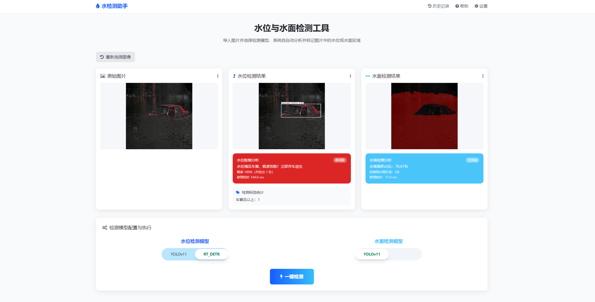
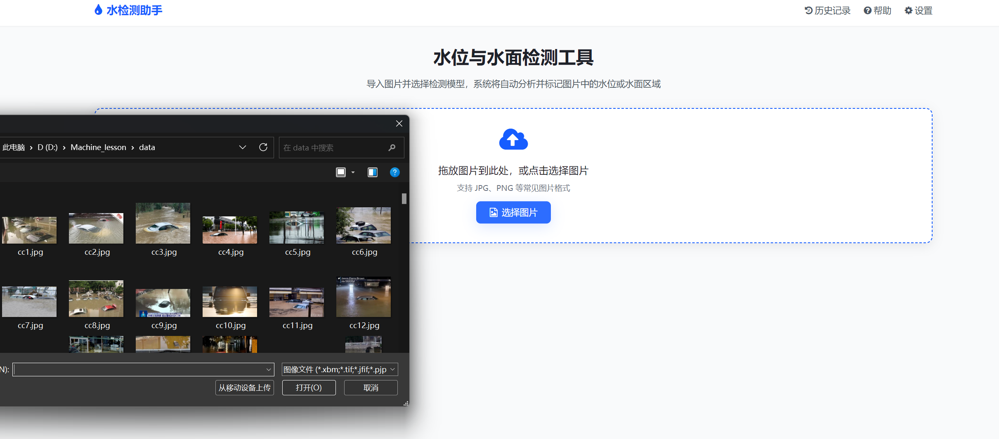
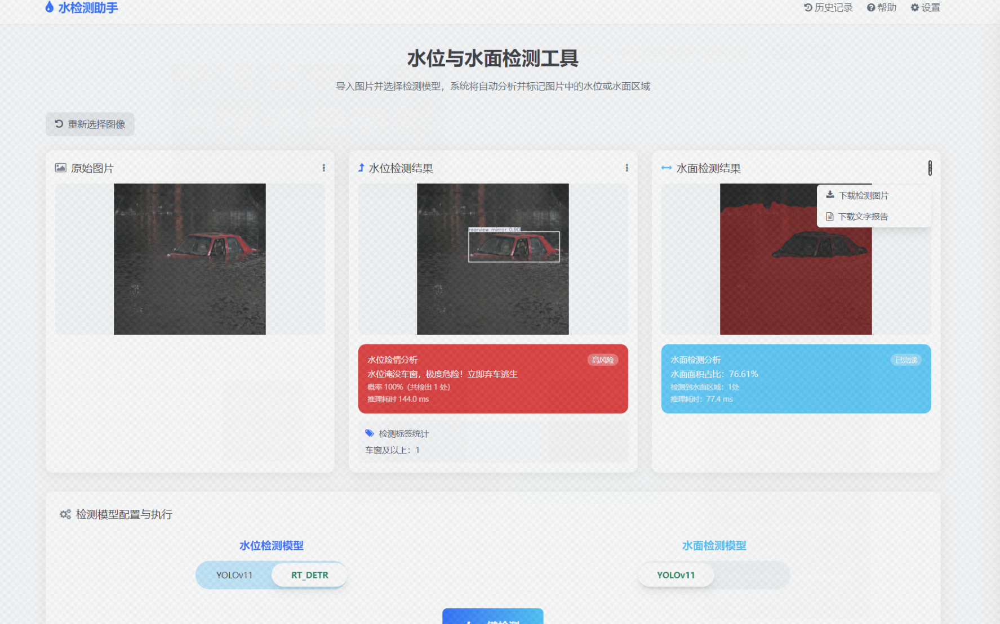

# 基于图像和深度学习的内涝监测

## 项目概述
本项目以“基于图像和深度学习的内涝监测”为核心，将整体任务拆解为**数据集构建、目标检测模型开发、语义分割模型开发、交互系统集成**四大模块，明确各步骤的工具、算法与处理目标，确保流程可落地、结果可验证。

## 一、图像标注与数据集构建
### 1.1 视觉特征定义
明确内涝图像中“车辆-水面”核心视觉特征：
- 车辆淹没部位三类区分：车轮顶部及以下、车轮顶部至车窗下沿、车窗及以上；
- 水面与地面/道路的边界特征（连续、不规则、与背景对比度显著）。

### 1.2 车辆淹没部位标注（YOLO 格式）
1. 工具：X-Anylabeling
2. 标注流程：
   - 导入待标注图像，选择「矩形框标注」工具，框选所有车辆（完整覆盖车轮/车窗，无遗漏）；
   - 类别标签分配：
     - 0：车轮顶部及以下
     - 1：车轮顶部至车窗下沿
     - 2：车窗及以上；
   - 导出：YOLO 格式 .txt 文件（含框体坐标+类别），与图像文件“一一对应”命名。

### 1.3 水面分割标注（掩码格式）
1. 工具：X-Anylabeling
2. 标注流程：
   - 选择「多边形标注」工具，沿水面与背景真实边界点击形成闭合多边形；
   - 类别标签分配：
     - 0：背景
     - 1：水面；
   - 导出：掩码格式 .png 文件（像素值 0=背景、1=水面），确保掩码分辨率与原图像一致。

### 1.4 数据集划分
对“车辆淹没部位数据集”“水面分割数据集”统一按以下比例划分：
- 训练集：70%
- 验证集：20%
- 测试集：10%

## 二、目标检测模型开发（车辆淹没部位判别）
### 2.1 模型调研
阅读 YOLOv11、RT-DETR 核心文献，总结核心优势：
- YOLOv11：小目标检测精度高、推理速度快；
- RT-DETR：遮挡目标检测鲁棒性强、无需NMS后处理。

### 2.2 开发流程
1. 框架选择：选用支持自定义数据集训练的深度学习框架（如PyTorch）；
2. 环境配置：搭建稳定训练环境，避免版本冲突，基于预训练权重微调；
3. 参数调优：设置合理 epoch、学习率，迭代优化模型参数；
4. 模型输出：得到适配车辆淹没部位检测的最终训练模型。

### 2.3 性能评估
1. 评估指标：准确率(accuracy)、精确率(precision)、召回率(recall)、F1-Score；
2. 评估范围：训练集、验证集、测试集；
3. 效率评估：统计训练时间、测试时间。

## 三、语义分割模型开发（水面分割）
### 3.1 模型调研
阅读 YOLOv11、Deeplabv3+、U-Net 核心文献，总结语义分割优势：
- YOLOv11：端到端分割、速度快；
- Deeplabv3+：全局上下文信息捕捉能力强；
- U-Net：医学/小场景分割精度高，适配水面边界细节。

### 3.2 开发流程
1. 框架选择：选用支持自定义数据集训练的深度学习框架（如PyTorch）；
2. 环境配置：搭建稳定训练环境，避免版本冲突，基于预训练权重微调；
3. 参数调优：设置合理 epoch、学习率，迭代优化模型参数；
4. 模型输出：得到适配水面分割的最终训练模型。

### 3.3 性能评估
1. 评估指标：平均像素准确率（mPA）、平均交并比（mIoU）；
2. 评估范围：训练集、验证集、测试集；
3. 模型选择：基于评估结果选择性能最优的2个模型；
4. 效率评估：统计训练时间、测试时间。

## 四、交互系统集成
### 4.1 开发技术栈
- 前端：HTML + CSS + JavaScript
- 核心功能：积水识别 + 车辆淹没部位判别

### 4.2 系统核心功能
- 支持图像上传，以及目标检测/图像分割结果下载；
- 图像与检测/分割结果左右分屏对比显示；
- 自动统计不同淹没部位车辆的数量；
- 支持选择/调用不同的检测/分割模型（YOLOv11/RT-DETR/Deeplabv3+等）。

### 4.3 系统效果图
#### 主界面

#### 图片上传界面

#### 检测结果界面

## 项目说明
- 数据集：基于真实内涝场景图像构建，包含车辆淹没部位、水面分割两类标注；
- 模型：适配内涝场景的轻量化检测/分割模型，兼顾精度与速度；
- 系统：轻量化交互界面，支持本地部署，操作简单易上手。